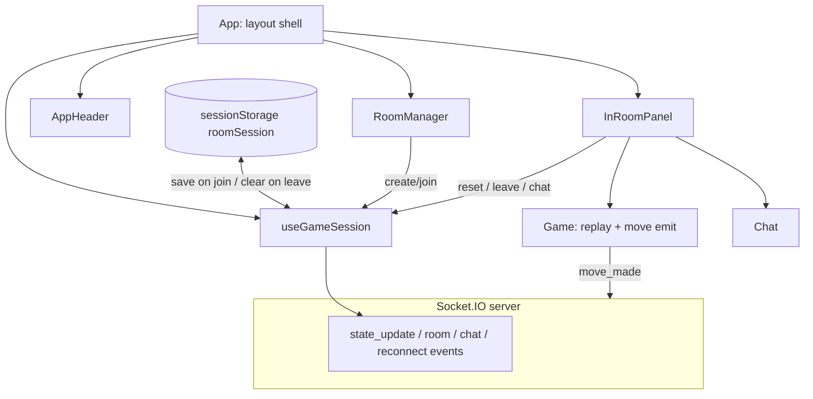

# Ultimate Tic Tac Toe — Web frontend

This document describes how the React app in `Web/src` is structured: where state lives, how data flows, and what each piece is responsible for.

## Configuration (local vs production)

The Socket.IO URL is resolved in `service/socket.ts`:

1. **`VITE_SOCKET_URL`** from the environment (Vite exposes only variables prefixed with `VITE_`).
2. If unset in **development**, it falls back to `http://localhost:8085`.

| File | When it applies |
|------|------------------|
| [`.env.development`](.env.development) | `npm run dev` |
| [`.env.production`](.env.production) | `npm run build` / production bundle |
| [`.env.example`](.env.example) | Copy/reference; use `.env.*.local` for overrides (gitignored patterns in `.gitignore`) |

**GitHub Pages + API on another host:** set `VITE_SOCKET_URL` in `.env.production` to the public origin of your Socket.IO server (e.g. `https://api.yourdomain.com`). The API must allow your Pages origin via `SOCKET_SERVER_ALLOWED_ORIGINS` when running with `SPRING_PROFILES_ACTIVE=prod` (see `API/API_CONTRACT.md`).

**Note:** `vite.config.ts` `base` (e.g. `/UltimateTicTacToe/` for GitHub Pages) only affects static asset URLs; it is separate from `VITE_SOCKET_URL`.

## Entry and global wiring

`index.tsx` mounts a single root: `ReactDOM.createRoot(...).render(<App />)`. There is no router; one screen tree is driven by session state from **`useGameSession`**.

The server link is a **Socket.IO client** created once per page load in `service/socket.ts` (URL from `VITE_SOCKET_URL` / dev fallback). `useGameSession` and `Game` both call `getSocket()` and share that **module-level singleton**.

## Where state lives (source of truth)

Almost all **remote** and **session** state is in **[`hooks/useGameSession.ts`](src/hooks/useGameSession.ts)** (consumed by `App`):

| State | Role |
|--------|------|
| `socket` | Same singleton from `getSocket()` |
| `isConnected`, `statusMessage`, `errorMessage` | Connection and user-facing status |
| `currentRoom`, `playerRole`, `roomStatus` | Which room you are in and server room phase |
| `gameHistory` | Full move history from `state_update` |
| `chatMessages` | Chat lines from `get_message` |
| `wasInRoom`, `reconnectTimeout` | Internal: room id on disconnect; 60s timer when opponent disconnects |

**Refs** (not React state, synced each render): `currentRoomRef`, `wasInRoomRef`, `playerRoleRef`, `pendingSelfReconnectRef`, `reconnectRetryRef`, `reconnectTimeoutRef`, `reconnectRetryTimerRef` — used inside socket handlers so `connect` / `disconnect` always see the latest room id without stale closures.

**`sessionStorage`** via [`utils/roomSession.ts`](src/utils/roomSession.ts): `{ roomId, playerRole }` saved on `player_joined` / `game_started` / successful `player_reconnected`; cleared on `resetLobbyState` (leave, timeout, room closed, or permanent reconnect failure).

The hook registers **all inbound** socket listeners (`connect`, `disconnect`, `player_joined`, `game_started`, `player_disconnected`, `player_reconnected`, `room_timeout`, `state_update`, `get_message`, `room_closed`, `error`, etc.) and exposes **callbacks** that `socket.emit(...)` (plus internal `attemptRoomReconnect` → `reconnect_to_room`).

So: **server → hook listeners → React state → props down**. **User actions → callbacks from hook → `socket.emit`**.

## UI branching (what you see when)

[`App.tsx`](src/App.tsx) is a thin shell: it calls `useGameSession()` and branches on `currentRoom`.

1. **`currentRoom === null`** → **`RoomManager`** (create/join by room id). Disabled until `isConnected`.
2. **`currentRoom` set** → **`InRoomPanel`**: chat and leave button always; game UI only when in progress.
3. **`roomStatus === 'IN_PROGRESS'`** (`isInGame`) → **`GameControls`** (until the game is terminal) + **`Game`**. Before that (e.g. `WAITING_FOR_PLAYER` or `WAITING_RECONNECT`), you are “in a room” but **`Game` is not rendered**—only chat, leave, and status text in **`AppHeader`**.

When the opponent disconnects (`WAITING_RECONNECT`), the remaining player sees **“Opponent disconnected. Waiting for reconnection…”** in the status bar only. The board reappears when `player_reconnected` sets `roomStatus` back to `IN_PROGRESS`.

Terminal game detection uses **`gameUtils.isGameTerminal`** on the **latest** board in `gameHistory` inside the hook; that hides dev **`GameControls`** when the meta-game is over.

## Reconnection (automatic only)

Reconnection is **fully automatic**; there is no manual reconnect control in the UI.

| Trigger | Behavior |
|---------|----------|
| Socket **`connect`** after disconnect | If `wasInRoom` was set on `disconnect`, emit `reconnect_to_room` for that room. |
| Socket **`connect`** after page load | If `sessionStorage` has a saved session, restore `currentRoom` / `playerRole` and emit `reconnect_to_room`. |
| **`error`** during a pending self-reconnect | Retry up to **2** times (1s apart). After that, clear session and `resetLobbyState` if the message looks like a dead room / failed reconnect. |
| Opponent disconnect | `player_disconnected` → status message + 60s local timer (mirrors server timeout UX). |
| Success | `player_reconnected` + `state_update`; status shows “You reconnected…” vs “Opponent reconnected…” based on `pendingSelfReconnectRef`. |

**Note:** Rooms live in server memory. After an **API restart**, stored session data may point at a room that no longer exists; reconnect will fail, session is cleared, and the user returns to the lobby. Create or join a new room.

See [API_CONTRACT.md](API_CONTRACT.md) for server events (`reconnect_to_room`, `WAITING_RECONNECT`, 60s timeout).

## Component responsibilities (top → bottom)

### `App`

- Calls **`useGameSession()`** and composes layout only (no socket imports).
- Renders **`AppHeader`**, then either **`RoomManager`** or **`InRoomPanel`**.

### `hooks/useGameSession.ts`

- Owns socket lifecycle (`socket.connect()` in `useEffect`).
- Central hub for **all server events** and **all emits** except **`move_made`** (see `Game`).
- Returns **`UseGameSessionResult`**: state, derived flags (`isInGame`, `gameIsTerminal`), and actions (`createRoom`, `joinRoom`, `sendMessage`, `resetBoard`, `setAlmostWon`, `leaveRoom`, `dismissError`).

### `AppHeader`

- Presentational: connection indicator, status text, room id, role, dismissible error banner.

### `InRoomPanel`

- Presentational: in-room layout—conditional **`GameControls`** + **`Game`**, **`Chat`**, leave button.

### `RoomManager`

- **Local** state: room id string.
- **`generateRoomId()`** / **`normalizeRoomId()`** from [`utils/roomId.ts`](src/utils/roomId.ts) for create/join payloads.
- Calls **`onCreateRoom` / `onJoinRoom`** with typed payloads. It does not talk to the socket directly. Joining a room in `WAITING_RECONNECT` on the server is treated as reconnect (see API).

### `utils/roomSession.ts`

- **`saveRoomSession` / `loadRoomSession` / `clearRoomSession`** — `sessionStorage` key `uttt_room_session` for refresh/reconnect after navigation.

### `game/initialGameState.ts`

- **`createInitialGameHistory()`** — empty board used when resetting lobby state.

### `Chat`

- **Local** state: draft message.
- **Read-only** `messages` from parent; **`onSendMessage`** builds `SendMessagePayload` with `room` from props.

### `GameControls`

- Pure UI: **Reset board** and **Set almost won** → hook’s `resetBoard` / `setAlmostWon`.

### `Game`

- **Props from `InRoomPanel`:** `history`, `playerRole`, `currentRoom`, `onPlayAgain`, `onBackToLobby`.
- **Local** state: `userStepNumber` for **replay / scrub** through history.
- **Emits `move_made` itself** via `getSocket()` (only path where moves leave the client without going through the hook).
- Composes **`GameBoard`**, **`GameInfo`**, **`PostGameActions`**.

### `GameBoard` / `Board` / `GameInfo` / `PostGameActions`

- Unchanged presentation and replay behavior (see prior sections in git history if needed).

### `types.ts` / `gameUtils.ts` / `roomId.ts`

- **Types:** payloads and `BoardState` / `StateMessage` shapes shared across UI (`RoomStatus` includes `WAITING_RECONNECT`).
- **Pure helpers:** meta winner, meta draw, terminal game—used by `Game` and `useGameSession`.
- **Room ids:** 5-character uppercase alphanumeric; normalized on join input.

## Data flow diagram

## Notable design choices

1. **Split socket usage:** `useGameSession` owns most emits/listeners; **`Game` emits moves** directly. Move traffic is not threaded through hook props like chat/room actions.
2. **Thin `App`:** Session orchestration lives in one hook file; `App` stays easy to read (~50 lines).
3. **Viewed vs authoritative state:** `gameHistory` in the hook is authoritative; `Game`’s `userStepNumber` only changes **which slice of history is shown**.
4. **Refs for socket handlers:** Room id and reconnect flags use refs so the listener `useEffect` does not re-subscribe on every room change.
5. **Automatic reconnect only:** No user-triggered reconnect button.

## Summary

**`useGameSession` is the hub for room, chat, connection, reconnection, and history; `App` composes UI; `Game` adds local replay UX and sends moves; leaf components stay mostly stateless except for small local UI state.**
