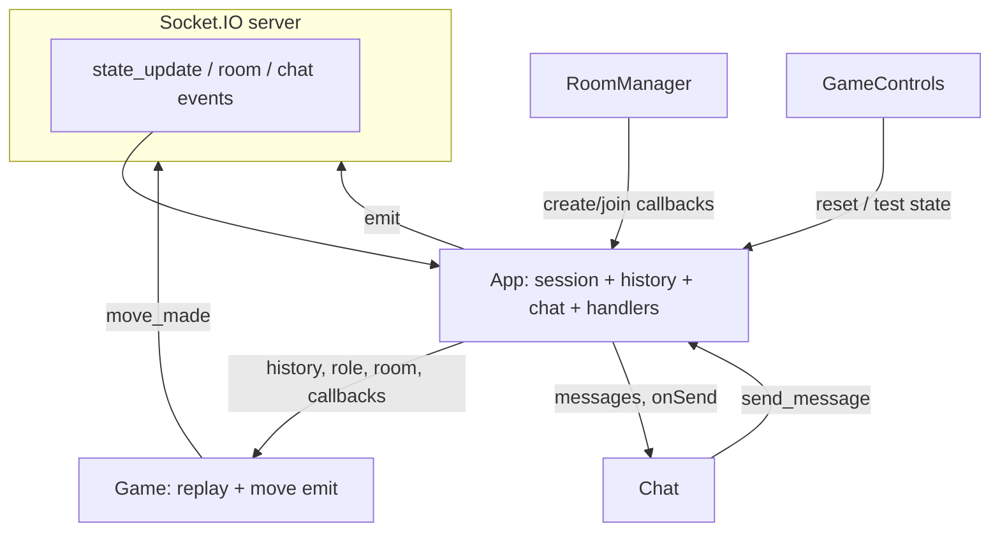

# Ultimate Tic Tac Toe — Web frontend

This document describes how the React app in `Web/src` is structured: where state lives, how data flows, and what each piece is responsible for.

## Configuration (local vs production)

The Socket.IO URL is resolved in `service/socket.ts`:

1. **`VITE_SOCKET_URL`** from the environment (Vite exposes only variables prefixed with `VITE_`).
2. If unset in **development**, it falls back to `http://localhost:8085`.

| File | When it applies |
|------|------------------|
| [`.env.development`](.env.development) | `npm run dev` |
| [`.env.production`](.env.production) | `npm run build` / production bundle |
| [`.env.example`](.env.example) | Copy/reference; use `.env.*.local` for overrides (gitignored patterns in `.gitignore`) |

**GitHub Pages + API on another host:** set `VITE_SOCKET_URL` in `.env.production` to the public origin of your Socket.IO server (e.g. `https://api.yourdomain.com`). The API must allow your Pages origin via `SOCKET_SERVER_ALLOWED_ORIGINS` when running with `SPRING_PROFILES_ACTIVE=prod` (see `API/API_CONTRACT.md`).

**Note:** `vite.config.ts` `base` (e.g. `/UltimateTicTacToe/` for GitHub Pages) only affects static asset URLs; it is separate from `VITE_SOCKET_URL`.

## Entry and global wiring

`index.tsx` mounts a single root: `ReactDOM.createRoot(...).render(<App />)`. There is no router; one screen tree is driven entirely by `App` state.

The server link is a **Socket.IO client** created once per page load in `service/socket.ts` (URL from `VITE_SOCKET_URL` / dev fallback). `App` and `Game` both call `getSocket()` and share that **module-level singleton**.

## Where state lives (source of truth)

Almost all **remote** and **session** state is in **`App`**:

| State | Role |
|--------|------|
| `socket` | Same singleton from `getSocket()` |
| `isConnected`, `statusMessage`, `errorMessage` | Connection and user-facing status |
| `currentRoom`, `playerRole`, `roomStatus` | Which room you are in and server room phase |
| `gameHistory` | Full move history from `state_update` |
| `chatMessages` | Chat lines from `get_message` |
| `wasInRoom`, `reconnectTimeout` | Disconnect / reconnect UX |

`App` registers **all inbound** socket listeners (`connect`, `disconnect`, `player_joined`, `game_started`, `state_update`, `get_message`, `room_closed`, etc.) and updates this state. Outbound actions are **`useCallback` handlers** that `socket.emit(...)`.

So: **server → `App` listeners → React state → props down**. **User actions → callbacks from `App` → `socket.emit`**.

## UI branching (what you see when)

1. **`currentRoom === null`** → only **`RoomManager`** (create/join by room id). Disabled until `isConnected`.
2. **`currentRoom` set** → **`game-container`**: chat, leave button, and conditionally reconnect / game UI.
3. **`roomStatus === 'IN_PROGRESS'`** (`isInGame`) → **`GameControls`** (until the game is terminal) + **`Game`**. Before that (e.g. waiting for opponent), you are “in a room” but **`Game` is not rendered**—only lobby-in-room chrome (chat, leave, reconnect banner when applicable).

Terminal game detection uses **`gameUtils.isGameTerminal`** on the **latest** board in `gameHistory` inside `App`; that hides dev **`GameControls`** when the meta-game is over.

## Component responsibilities (top → bottom)

### `App`

- Owns socket lifecycle (`socket.connect()` in `useEffect`).
- Central hub for **all server events** and **all emits** except **`move_made`** (see `Game`).
- Passes **data and callbacks** into children; no context API.

### `RoomManager`

- **Local** state: room id string.
- Calls **`onCreateRoom` / `onJoinRoom`** with typed payloads (`CreateRoomPayload`, `JoinRoomPayload`). It does not talk to the socket directly.

### `Chat`

- **Local** state: draft message.
- **Read-only** `messages` from `App`; **`onSendMessage`** builds `SendMessagePayload` with `room` from props. Scroll-to-bottom when `messages` changes.

### `GameControls`

- Pure UI: **Reset board** and **Set almost won** → `App`’s `handleResetBoard` / `handleSetAlmostWon` (both emit with `currentRoom`).

### `Game`

- **Props from `App`:** `history` (= `gameHistory`), `playerRole`, `currentRoom`, `onPlayAgain`, `onBackToLobby`.
- **Local** state: `userStepNumber` for **replay / scrub** through history (which step is *viewed* vs latest from server).
- **Derives** from history + viewed step: current board slice, meta winner/draw (`gameUtils`), whose turn, `canMakeMove`, whether the match is terminal at the **last** step.
- **Emits `move_made` itself** via `getSocket()` (only path where moves leave the client without going through an `App` callback).
- Composes **`GameBoard`**, **`GameInfo`**, **`PostGameActions`** (post-game only when terminal at latest step and user is viewing latest).

### `GameBoard`

- Maps the 9 sub-boards; decides **which sub-board is “active”** (highlight / accepts clicks) from `BoardState.availableBoard`, `canMakeMove`, and whether that meta cell is already decided.
- For won sub-boards, fills display squares with the winner for visuals.
- Delegates cell clicks to **`onBoardGameClick(i, j)`** from `Game`.

### `Board`

- One 3×3 grid of buttons; **`active`**, **`disabled`**, empty cell → whether a click fires **`onClick(i)`**.

### `GameInfo`

- Status line (winner / draw / next player, personalized with `playerRole`).
- **History list**: toggles visibility; **`jumpTo(step)`** calls **`onStepNumberChange`** up to `Game` (does not change server state).

### `PostGameActions`

- **`onPlayAgain`** → in `App` this is **`handleResetBoard`** (reset emit).
- **`onBackToLobby`** → **`handleLeaveRoom`** (`leave_room` emit + eventual `room_closed` / local reset).

### `types.ts` / `gameUtils.ts`

- **Types:** payloads and `BoardState` / `StateMessage` shapes shared across UI.
- **Pure helpers:** meta winner, meta draw, terminal game—used by `Game` and `App`.

## Data flow diagram

## Notable design choices

1. **Split socket usage:** `App` owns most emits/listeners; **`Game` emits moves** directly. Behavior is still one shared socket, but **move traffic is not threaded through `App` props** like chat/room actions.
2. **Viewed vs authoritative state:** `gameHistory` in `App` is authoritative; `Game`’s `userStepNumber` only changes **which slice of history is shown** and whether moves are allowed (only on latest step when it’s your turn).
3. **TODOs in code:** Comments in `App` and `Game` suggest a future refactor (e.g. dedicated socket/orchestration component, review of “non-singleton” wording—`getSocket` is actually a singleton).

## Summary

**`App` is the hub for room, chat, connection, and history from the server; `Game` adds local replay UX and sends moves; presentation leaf components stay mostly stateless except for small local UI state.**
